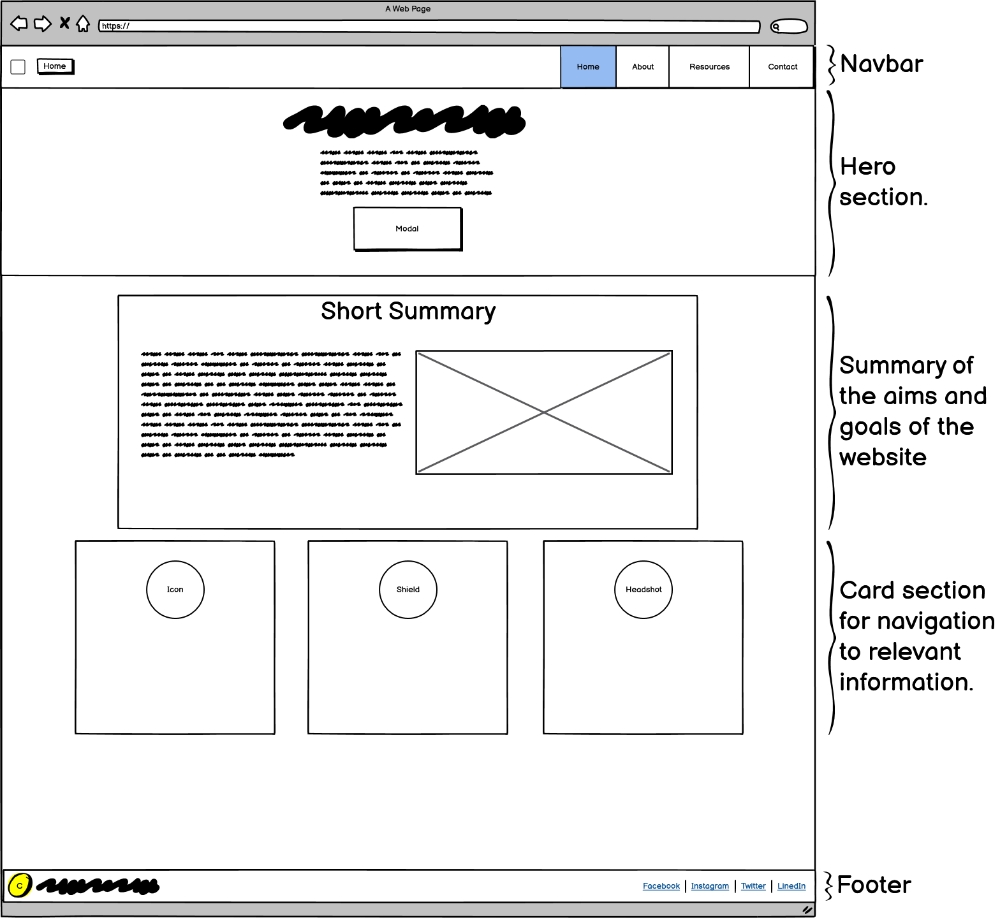
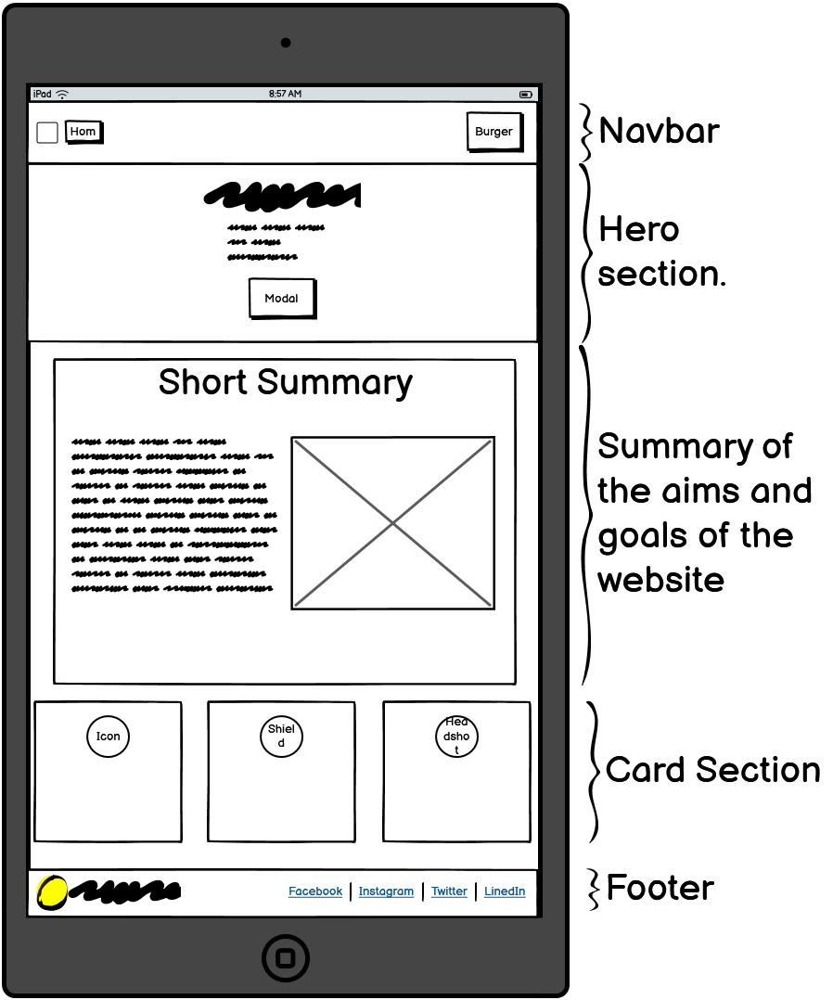
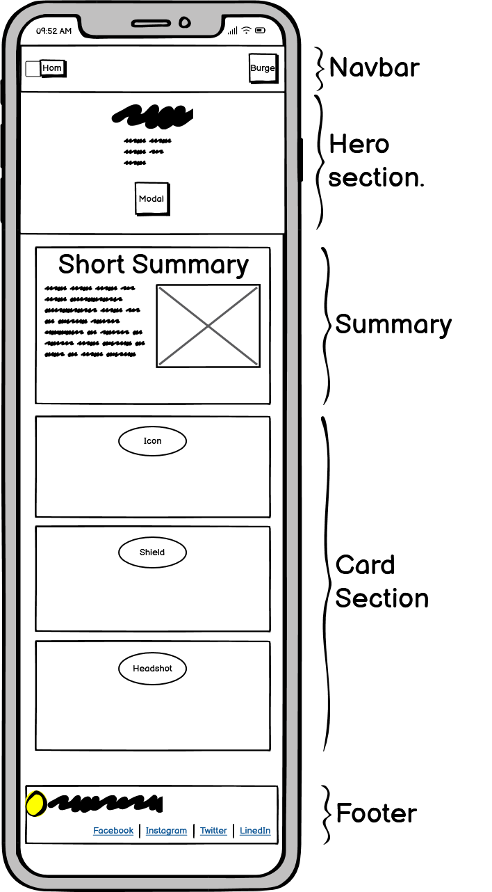
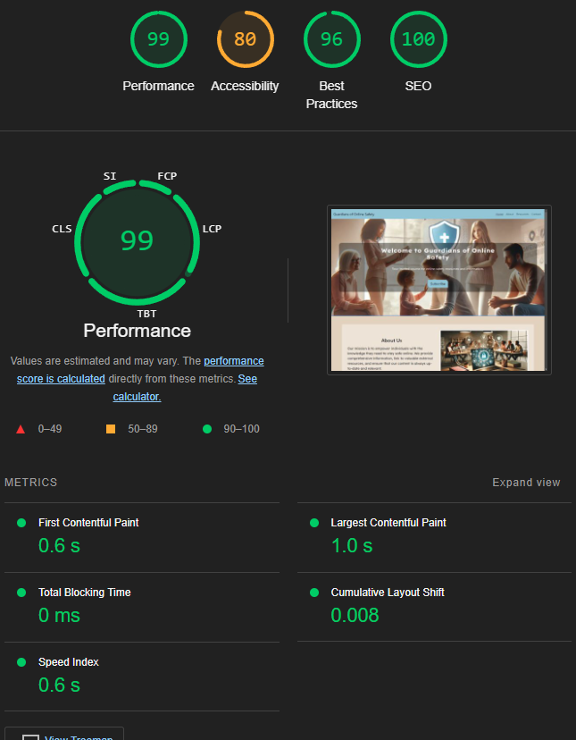
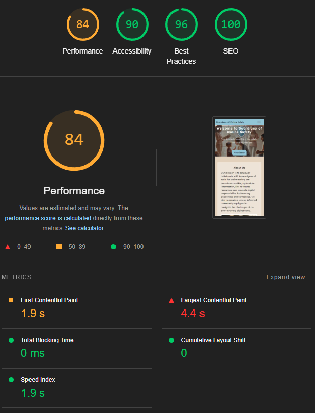

## Project Safeguarding.

[Live site preview.](https://naxiris.github.io/Guardians-of-Online-Safety/)

## Introduction?

This project aims to create a website utilizing HTML, CSS and Bootstrap 5 to create a website designed to inform users of safeguarding practices by providing information that is easily accessible. This ensures that the user can recognize and respond to safeguarding concerns.

# UX

The user stories used as reference;

<ul>
    <li>As a concerned parent, I want to access information on safeguarding policies and procedures so that I can ensure the safety and well-being of my child.</li>
    <li>As a young person, I want to read blog posts and articles about safeguarding so that I can understand my rights and know how to protect myself.</li>
    <li>As a victim of safeguarding issues, I want to find support services and helplines so that I can receive the help and counseling I need.</li>
</ul>

# Strategy

By utilizing Chat GPT I have turned these user stories into guided steps that include;

<ul>
    <li>The collection of information regarding safeguarding.</li> 
    <li>A navigation bar that includes Home, About, Resources and Contact for the user.</li>
    <li>The creation of a newsletter modal for those who want to keep updated.</li>
</ul>

# Design

The design must be **simple and easy to read**, so after searching Google fonts, I have decided on using the fonts [Lexend Exa](https://fonts.google.com/specimen/Lexend+Exa) for the title and headings and [Lexend Deca](https://fonts.google.com/specimen/Lexend+Deca). This ensures a difference between heading and paragraph that is visible.

A Hero banner is essential to inform the user, at a glance, what the site is about.

Using this information, I have created a wireframe for the main page that will help guide me through this process as a reference.

Sections of the site should be dedicated to information in clear and concise mediums, so a card system may be implemented to redirect people to the desired locations or information. Alternatively, Bootstrap has a carousel that may be useful for such things.

During the creation of the website, I decided to add revealing content as I scrolled to make it feel more interactive. Utilizing keyframes, I achieved this with CSS.

# Results of Lighthouse scores

# Technologies Used

[Bootstrap 5.3.3](https://getbootstrap.com/) - HTML, CSS and JS library 
[Google Fonts](https://fonts.google.com/) - Fonts for page layout and feel 
[Copilot (Chat GPT Version 4o)](https://github.com/features/copilot) - Help with user stories and steps to achieve 
[DALL-E 3](https://openai.com/index/dall-e-3/) - Image Generation